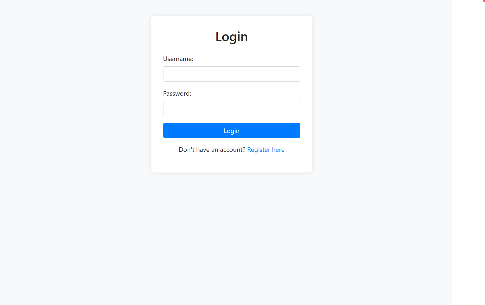
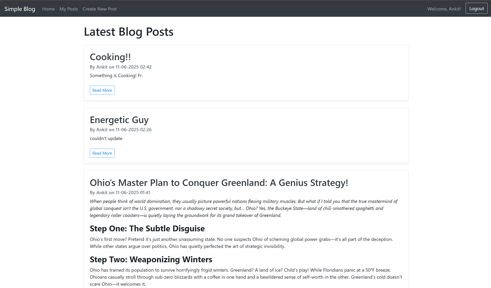

# Simple Blog Platform

## Project Description

A lightweight and user-friendly blog platform built with Spring Boot, Thymeleaf, and Spring Security. This application allows users to create, read, update, and delete their own blog posts, and interact with other posts through comments. It showcases fundamental Spring Boot features including MVC architecture, data persistence with Spring Data JPA, user authentication and authorization, and RESTful APIs.

## Key Features

* **User Authentication & Authorization:** Secure user registration, login, and role-based access control using Spring Security.
* **CRUD Operations for Posts:** Users can create, view, edit, and delete their own blog posts.
* **Commenting System:** Users can add comments to any blog post.
* **Tagging Functionality:** Posts can be categorized with tags for easier navigation and search.
* **Rich Text Editor:** Integrated Quill.js for creating rich and formatted blog content.
* **Database Integration:** Persistent storage for users, posts, comments, and tags using H2 (for development) and easily configurable for other databases.
* **Responsive UI:** Developed with Bootstrap and Thymeleaf for a modern and accessible user experience.

## Technologies Used

* **Backend:**
  * Java 17 (or your version)
  * Spring Boot 3.x.x
  * Spring Data JPA
  * Spring Security
  * Lombok
  * Maven (or Gradle)
  * H2 Database (for development/testing)
* **Frontend:**
  * Thymeleaf
  * Bootstrap 4.x
  * Quill.js (Rich Text Editor)
  * HTML, CSS, JavaScript

## Setup and Installation

### Prerequisites

* Java Development Kit (JDK) 17+
* Maven 3.6+ (or Gradle if applicable)
* Git

### Steps

1. **Clone the repository:**

    ```bash
    git clone [https://github.com/your-username/simple-blog-platform.git](https://github.com/your-username/simple-blog-platform.git)
    cd simple-blog-platform
    ```

2. **Build the project:**

    ```bash
    # For Maven:
    mvn clean install
    # For Gradle:
    # ./gradlew build
    ```

3. **Run the application:**

    ```bash
    # For Maven:
    mvn spring-boot:run
    # For Gradle:
    # ./gradlew bootRun
    ```

    The application will start on `http://localhost:8080`.

## How to Use

1. **Register:** Navigate to `http://localhost:8080/register` to create a new user account.
2. **Login:** Use your new credentials to log in.
3. **Create Post:** Click "Create New Post" to write and publish your blog entry.
4. **View Posts:** See all posts on the homepage (`/`) or your own posts on `/posts/user`.
5. **Edit/Delete Post:** On your user posts page, you can edit or delete your entries.
6. Add Comments:** On any post's detail page, you can add comments.

## Screenshots / Demo


**Login Page:**




**Home Page:**


